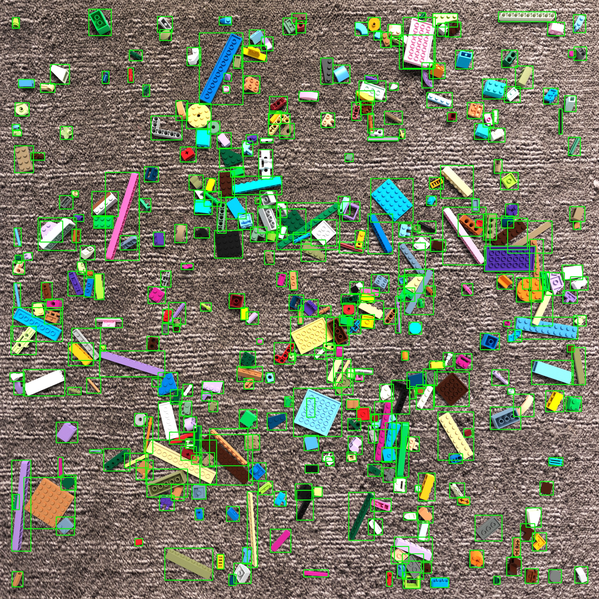
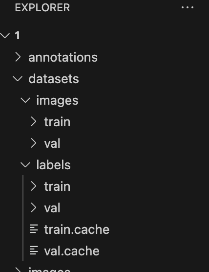
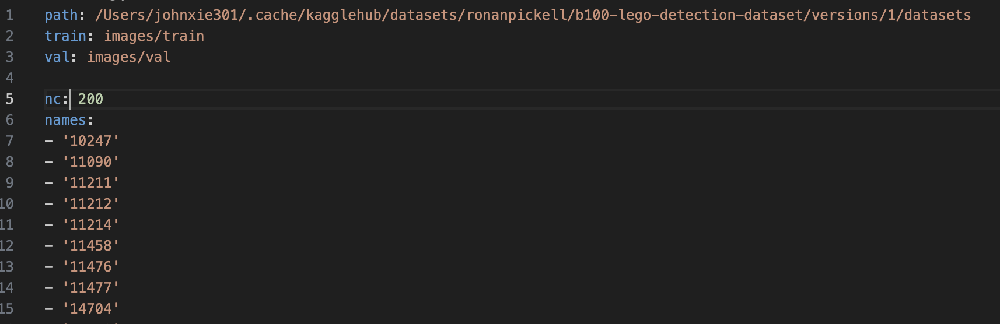

# Obeject Detection Project: Lego_Piece_Detection
Object Detection on Lego pieces using Yolo V11n to train on Lego piece datasets.

## Catalog
1. [Problem](#problem)
2. [Data](#data)
3. [Data Processing](#data-processing)
4. [Model](#model)
5. [Results](#results)

## Problem

The goal of this project is to build an object detection model to identify and classify objects from images filled with random lego pieces. Using dataset provided on kaggle, I will train with a pre-trained object detection model YOLO v11n(You Only Look Once). The challenge involves detecting objects in images and labeling them with the correct class.

## Data

The dataset for this project consists of images and corresponding annotations. The annotations needed to be stored in the **YOLO format**, with a `.txt` file for each image, containing class labels and bounding box coordinates. However, the origional annotations provided was stored in **Pascal VOC format** (XML file). Therefore, we will need to do some data processing before training.  

The dataset is split into a training set and a validation set.

- **Images**: Located in the `datasets/train/images/` and `datasets/val/images/` directories.
- **Labels**: Located in the `datasets/train/labels/` and `datasets/val/labels/` directories in YOLO format.

### Pascal VOC Format
Pascal VOC annotations are typically stored in XML files, with each XML file containing:
- Object class labels
- Bounding box coordinates (xmin, ymin, xmax, ymax)

### Dataset Format (YOLO)
Each label file consists of the following:
<class_id> <x_center> <y_center> <width> <height>

PS:YOLO labels needed to be normalized. 

## Data Processing

### 1. Convert Pascal VOC to YOLO format

To use YOLO, we need to convert the Pascal VOC dataset into **YOLO** format. 

Steps for converting Pascal VOC format to YOLO:
- Use openCV to get the width and Height of each image. 
- Read corresponding XML(Pascal VOC) files.
- Collect their class IDs, total of 200 classes.
- Convert the bounding boxes from Pascal VOC format (absolute pixel coordinates) to the YOLO format(center-relative).
- Create file paths for training, validation and testing.

### 2. Create a .yaml File to Record All the Path and Classes.

5 Variables in it:
- path
- train
- val
- nc (number of classes)
- names(names of all the classes)

## Model
### Option 1: YOLO v11n
'YOLO (You Only Look Once), a popular object detection and image segmentation model, was developed by Joseph Redmon and Ali Farhadi at the University of Washington. Launched in 2015, YOLO quickly gained popularity for its high speed and accuracy.'(Ultralytics)

'YOLO11 🚀 NEW: Ultralytics' latest YOLO models delivering state-of-the-art (SOTA) performance across multiple tasks, including object detection, segmentation, pose estimation, tracking, and classification, leverage capabilities across diverse AI applications and domains.'(Ultralytics)

Link to the model:https://docs.ultralytics.com/models/yolo11/#performance-metrics

In this project, I am using YOLO's newest model ------ YOLO V11n. N stands for nano. It is the smallest model that designed for real-time detection and edge devices due to its small memory footprint. As the trade off, accuracy will be less compared to other models. 

Our goal is to plant this to the phone and use in real-time, nano will be the best option. That way we don't need to struggle finding that missing piece. 

YOLO model is pretty robust. It does fine-tuning automatically. So changes on the model is not that necessary.

**PS**: If ultralytics reports error on the fine tuning API ray train, it needed to be version before 2.4. However, you can modified the py file from 'ray.train._internal.session_get_session' to 'ray.train._internal.session.get_session'

### Option 2: Self Train Model

## Results:
YOLO: It was bad. Maybe couple hours of training for 5 epochs is not enough for 200 class. Or the dataset is too bad. I would suggest crop the images out instead of using 5-8 MB size images for training since YOLO prefers to train images with size 640x640. Changing it from 640 to 1080 does not seem to do much better job for the result. 

### Confusion Matrix:
YOLO:

### F1 Curve:

### P Curve:

### R Curve:

